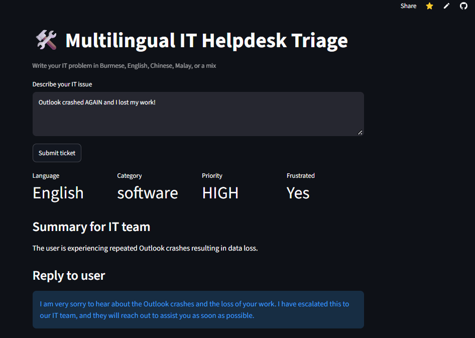

# 🛠️ Multilingual IT Helpdesk Triage

> 📚 **Learning project:** built to practise the techniques from DeepLearning.AI's [ChatGPT Prompt Engineering for Developers](https://www.deeplearning.ai/courses/chatgpt-prompt-eng) course. This is not a real helpdesk: no tickets are created and nobody will contact you.

**Try the demo:** https://supportdesk-triage-kai.streamlit.app


## About this project

After finishing the course, I wanted to check that I actually understood the lessons, not just watched them. So I built this small practice app using only the techniques the course taught.

You type an IT problem in **Burmese, English, Chinese, Malay, or a mix**, and the app tries to:

1. Detect the language
2. Classify the issue: hardware, network, account, software, or other
3. Notice if the user sounds frustrated
4. Set a priority (frustrated users are raised to high)
5. Summarize the problem in one English sentence
6. Reply politely in the user's own language
7. Ask a clarifying question if the message is too vague

I added Burmese as a personal challenge, because I was curious how well an LLM handles a language that gets less attention than English.

## Things to try

Please use made-up examples only, not real work or personal information.

| Try typing | What to look for |
|---|---|
| `My laptop won't connect to the office Wi-Fi` | A simple English network issue |
| `Outlook crashed AGAIN and I lost my work!!` | Does it notice the frustration and raise the priority? |
| `ကွန်ပျူတာ အင်တာနက် ချိတ်လို့ မရဘူး` | Burmese understanding and reply |
| `Laptop က screen မှိတ်တုတ်မှိတ်တုတ် ဖြစ်နေတယ်` | Mixed Burmese and English |
| `I cannot connect it` | A vague message: does it ask what "it" is? |
| `What time is lunch?` | Not an IT problem at all |

If you manage to break it, I'd love to hear how. That's the most useful feedback for my learning.

## What I practised from the course

| Course technique | How I used it here |
|---|---|
| Delimiters | The user's message goes inside `<message>` tags so the model doesn't confuse it with my instructions |
| Structured output | The model returns JSON, which my code extracts and checks with `json.loads` |
| Specifying steps | The prompt breaks the task into clear numbered steps |
| Checking conditions | Vague or non-IT messages are handled separately instead of guessed |
| Few-shot prompting | One example Burmese reply shows the tone I want |
| Reducing hallucination | The model is told not to promise fixes or timelines |
| Inferring | Detecting language, issue type, and frustration |
| Summarizing | A one-sentence English summary for IT |
| Transforming | Understanding any language and replying in the user's language |
| Expanding | Writing a short, personalized reply |
| Temperature | Set to 0 for consistent results |
| System and user roles | The system instruction sets the assistant's job; the user message carries the problem |

## What surprised me

- **One example goes a long way.** The model copied my few-shot Burmese reply almost word for word. Great for consistent tone, but it can make replies sound repetitive.
- **Vague messages expose weak prompts.** "I cannot connect it" got a confident wrong answer until I added a condition telling the model to ask a follow-up question.
- **AI returns text, not data.** The JSON has to be extracted and checked before the app can use it safely.
- **Real APIs fail sometimes.** I hit a "model overloaded" (503) error during testing, so the app now retries quietly instead of crashing.

## Why Gemini instead of OpenAI?

The course uses OpenAI's API. For practice, I used Google's Gemini Flash because its free tier let me experiment and share a demo without cost. It turned out to be a nice lesson too: the same prompting techniques worked on a different model, so the skills carry over.

## A small test

I wrote 20 test messages myself (Burmese, English, mixed, other languages, and a few non-IT ones) and labelled the answers I expected.

**Result: [X]/20** with both category and priority correct.



It's a tiny, informal test, but it showed me why evaluation matters when working with LLMs.

## Project structure

```
helpdesk-triage/
├── triage.py          # The prompt and the Gemini call (all the prompt engineering lives here)
├── app.py             # The Streamlit web page
├── eval.py            # The small accuracy test
├── requirements.txt   # Packages needed to run the app
└── images/            # Screenshots for this README
```

## Run it yourself

You'll need Python 3.10 or newer and a free API key from [Google AI Studio](https://aistudio.google.com).

```bash
git clone https://github.com/khine282/helpdesk-triage.git
cd helpdesk-triage
python -m venv venv
venv\Scripts\activate          # Mac: source venv/bin/activate
pip install -r requirements.txt
```

Create a `.env` file in the project folder:

```
GEMINI_API_KEY=your-key-here
```

Then start the app:

```bash
streamlit run app.py
```

To run the small test:

```bash
python eval.py
```

## Ideas for next time

- Detect and convert **Zawgyi** encoding (a lot of Burmese text still uses it instead of Unicode)
- Give the bot a small **knowledge base** of IT guides so it can suggest real fixes (a good way to practise RAG)
- Test **reply quality**, not just classification accuracy
- Connect it to a **Telegram bot** so messages can come from a phone

## Feedback welcome

I'm still learning, so any advice is really appreciated, especially:

- What would you improve first?
- What should I learn next: RAG, evaluation, or agents?

Feel free to open an issue or message me on LinkedIn.

## Acknowledgments

Thanks to DeepLearning.AI and OpenAI for the [ChatGPT Prompt Engineering for Developers](https://www.deeplearning.ai/courses/chatgpt-prompt-eng) course.

**Built by** Khine Zar Thwe (Kai) · [LinkedIn](https://linkedin.com/in/khine-zar-thwe-282kzt) · [Portfolio](https://kaizarthwe.com) · [GitHub](https://github.com/khine282)